# Step by step installing Git

Є багато різних GUI програм для роботи із **Git**, але зазвичай вони вимагають щоб був встановлений основний пакет консольних програм і вже кожен для себе вибирає чим користуватися, чи то консольними командами у **Git Bash**, чи то **TortoiseGit** як розширення до File Explorer, чи засобами **Visual Studio**, який із коробки прекрасно працює із Git.
Тому почнемо ми зі встановлення самого Git на комп'ютер.

1. Завантажуємо останню версію тут [https://git-scm.com/download/win](https://git-scm.com/download/win)

2. Встановлюємо із налаштуваннями по замовчуванню, або кому як зручно:
   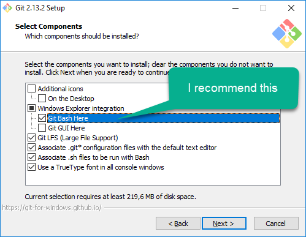 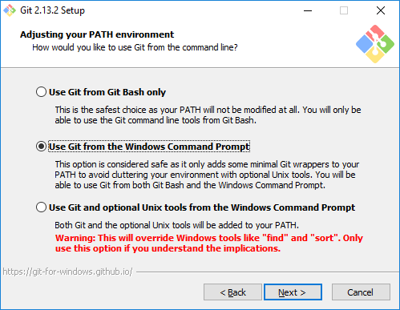
   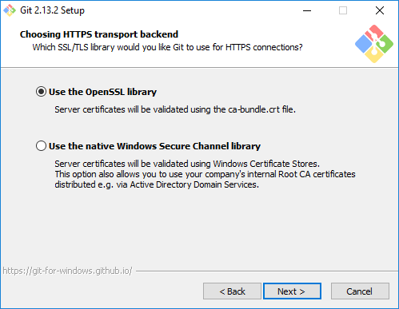 
   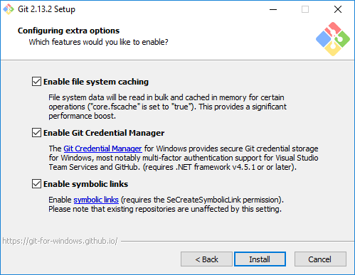 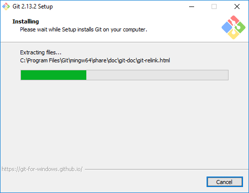

3. Конфігурація Git (можна пропустити, якщо буде встановлюватися **TortoiseSVN**)

   - відкрити Git Bash (або Command Prompt)

   - виконати наступні команди, підставивши свої дані (ці дані будуть використовуватися до усіх комітів, що відбуваються):

     ``` bash
     git config --global user.name "Emma Paris"
     git config --global user.email "eparis@mail.com"
     ```

     ці дані зберігаються у файлі `%USERPROFILE%\.gitconfig`

4. Опционально завантажити і встановити [TortoiseGit](https://tortoisegit.org/download/) із опціями по замовчуванню
   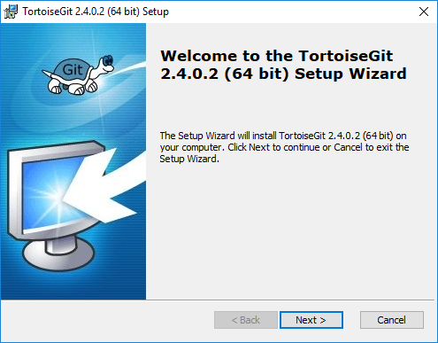 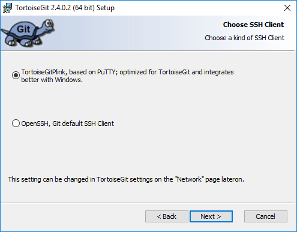

5. Після встановлення відкрити візард налаштування (**Run first start wizard**)   
   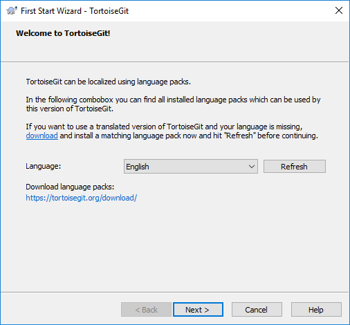 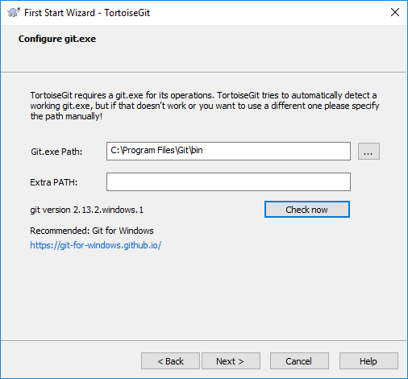
   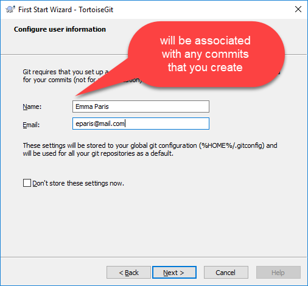 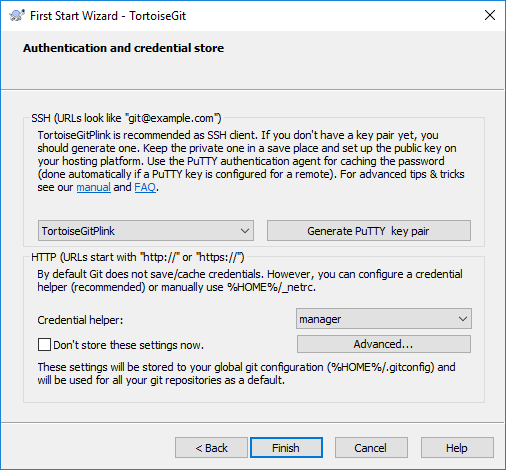

!!! note

    Генерувати SSH ключі не обов'язково, так як можна використовувати HTTPS протокол із авторизацією по логіну і паролю.
