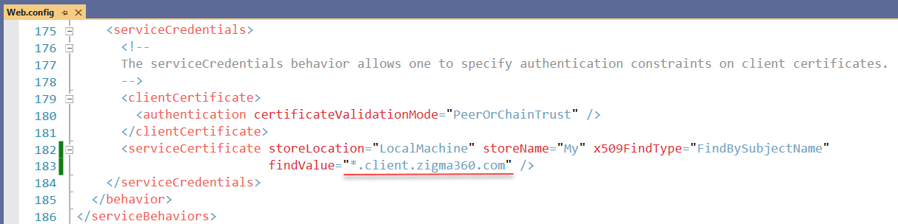

# Wildcard SSL certificate for Zigma cloud service using Let’s Encrypt

In this page will cover, how to generate a wildcard SSL certificate for the __*.client.zigma360.com__ domain using Let’s Encrypt free service and a PowerShell module [Posh-ACME](https://poshac.me/docs/v4/).

## Requirements and Platform Support

- Supports Windows PowerShell 5.1 (Desktop edition) **with .NET Framework 4.7.1** or later
- Supports PowerShell 6.2 or later ([Core edition](https://docs.microsoft.com/en-us/powershell/scripting/whats-new/differences-from-windows-powershell)) on all supported OS platforms.
- Requires `FullLanguage` [language mode](https://docs.microsoft.com/en-us/powershell/module/microsoft.powershell.core/about/about_language_modes)

To check PowerShell version: `$PSversionTable` or `get-host|Select-Object version`

## Installation Posh-ACME (Stable)

The latest release can found in the [PowerShell Gallery](https://www.powershellgallery.com/packages/Posh-ACME/). Installing is easy from the gallery using `Install-Module`. *See [Installing PowerShellGet](https://docs.microsoft.com/en-us/powershell/scripting/gallery/installing-psget) if you run into problems with it.*

```powershell
# install for all users (requires elevated privs)
Install-Module -Name Posh-ACME -Scope AllUsers

# install for current user
Install-Module -Name Posh-ACME -Scope CurrentUser
```

## Picking a Server

Before we begin, let's configure our ACME server to be the Let's Encrypt *Production* server.

```powershell
Set-PAServer LE_PROD
```

!!! note
    `LE_PROD` is a shortcut for the Let's Encrypt Production server's directory URL.
     Other currently supported shortcuts include `LE_STAGE`, `BUYPASS_PROD`, `BUYPASS_TEST`, and `ZEROSSL_PROD`.

!!! warning
    If the Set-PAServer command executes with an error `Set-PAServer : Errors occurred wile loading the format data file...xml is not digitally signed..` you will probably need to run this command as administrator `Set-ExecutionPolicy RemoteSigned -Force` and try to execute the previous command again.

## Your First Certificate

The bare minimum you need to request a certificate is just the domain name.
Assuming you've reviewed the TOS link from before, add `-AcceptTOS` to the original command to proceed. You only need to do this once when creating a new account. You also probably want to associate an email address with this account so you can receive certificate expiration notifications (replace ```admin@example.com``` with your one). So let's do that even though it's not required.

```powershell
New-PACertificate *.client.zigma360.com -AcceptTOS -Contact 'admin@example.com'
```

!!! note
    Multiple email addresses per account are supported. Just pass it an array of addresses.

Because you didn't specify a plugin, it will default to using the `Manual` DNS plugin. That manual plugin will also be prompting you to create a DNS TXT record to answer the ACME server's validation challenge for the domain.

At this point, you can either press `Ctrl+C` to cancel the process and modify your command or go ahead and create the requested TXT record and hit any key to continue. We'll cover plugins next, so for now create the record manually and press a key to continue. If you run into problems creating the TXT record, check out [Troubleshooting DNS Validation](https://poshac.me/docs/v4/Guides/Troubleshooting-DNS-Validation/).

The command will sleep for 2 minutes by default to allow the DNS changes to propagate. Then if the ACME server is able to properly validate the TXT record, the final certificate files are generated and the command should output the details of your new certificate. Only a subset of the details are displayed by default. To see them all, run `Get-PACertificate | fl`. The files generated in the output folder should contain the following:

- **cert.cer** (Base64 encoded PEM certificate)
- **cert.key** (Base64 encoded PEM private key)
- **cert.pfx** (PKCS12 container with cert+key)
- **chain.cer** (Base64 encoded PEM with the issuing CA chain)
- **chainX.cer** (Base64 encoded PEM with alternate issuing CA chains)
- **fullchain.cer** (Base64 encoded PEM with cert+chain)
- **fullchain.pfx** (PKCS12 container with cert+key+chain)

Posh-ACME is only designed to *obtain* certificates, not deploy them to your web server or service. The certificate details are written to the pipeline so you can either save them to a variable or pipe the output to another command. [Posh-ACME.Deploy](https://github.com/rmbolger/Posh-ACME.Deploy) is a sister module containing some example deployment functions for common services to get you started. But ultimately, it's up to you how you want to deploy your certificates.

The password on the PFX files is `poshacme` because we didn't override the default with `-PfxPass` or `-PfxPassSecure`. If you're running PowerShell with elevated privileges on Windows, you can also add the `-Install` switch to automatically import the certificate into the local computer's certificate store.

So now you have a certificate and that's great! But Let's Encrypt certificates expire relatively quickly (90 days).

## Updating an existing certificate for the **zigma4clients** azure cloud service

All certificates issued by Let's Encrypt expire in 90 days, so we need to renew it in advance and update the old one in the service.
The service finds certificate by name and it means there is no need to change any settings.


### Renewals

The module saves all of the parameters associated with an order and re-uses the same values to renew it.
Let's Encrypt currently caches authorizations for roughly 30 days, so the forced renewal won't need to go through validating the challenges again.
Run this command to renew the certificate:

```powershell
Submit-Renewal -Force -NoSkipManualDns
```

If the renewal is successfully completed you can see something like this:

```
Subject                  NotAfter             KeyLength Thumbprint                               AllSANs
-------                  --------             --------- ----------                               -------
CN=*.client.zigma360.com 3/10/2022 8:34:28 AM 2048      39EB0268B6FD669F7D4A879813B117F7635C50FE {*.client.zigma360.com}
```

If you see this message then it means you need to update a TXT record for your domain:

```
Please create the following TXT records:
------------------------------------------
_acme-challenge.client.zigma360.com -> 5JzcKSxpnV7P0uCSyQ6NMwYj79llkrHYR3io5kv9Akc
------------------------------------------

Press any key to continue.:
```

To do so, open your domain configuration panel for example https://domainname.shop/admin?id=870947&edit=dns&advanced=1

find the `_acme-challenge.client.zigma360.com` TXT record and put a new value.

Then go back to the PowerShell window and press any key, wait until you get the message about successfully renewal.

Run the command to show the path to the certificate:

```powershell
Get-PACertificate | fl
```

### Deployment

Azure key vault **zigma4clientskv** is used to store the SSL certificate. What we need to do is:

- open the *zigma4clientskv* from the Azure portal
- open the *Certificates* section
- select the *Wildcard-client-zigma360-com* certificate
- click the *New version* button
- choose *Method of Certificate Creation*: **Import**
- select a generated earlier new certificate, put the `poshacme` password or use your own and click the *Create* button

Then open the **zigma4clients** cloud service to update link to the certificate:

- open the *Configuration* sections
- find the `Certificate` setting with the `Certificate1` name and update the `thumbprint` attribute to a thumbprint of the new certificate
- click the **Save** button

The certificate is updated and the service takes it immediately is use.
